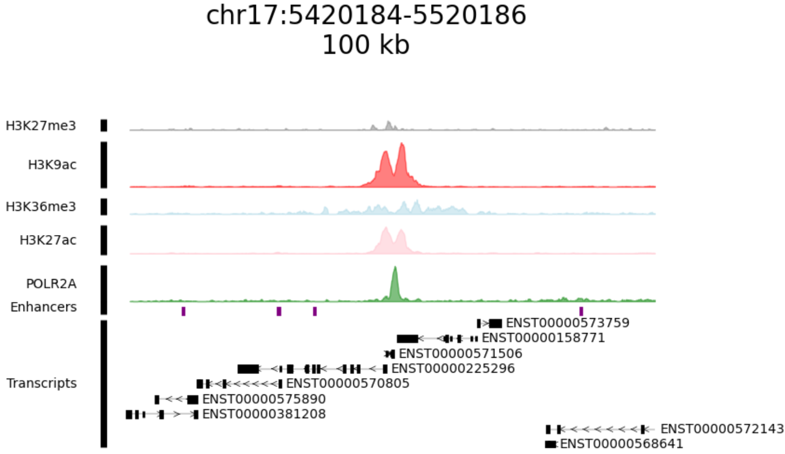

### VizFeat is a set of python functions built on top of matplotlib that can be used to:

* Visualize signal distribution of genome coverage files on top of given transcripts(ChIP, ATAC, read coverage from any experiment).
* Visualize genomic features given in bed format on top of given transcripts.

  

For the example run load the multichannel tensor and the bed file found in the example_data directory. The gtf file can be found for download in:
[https://ftp.ensembl.org/pub/release-112/gtf/homo_sapiens/Homo_sapiens.GRCh38.112.chr.gtf.gz](https://ftp.ensembl.org/pub/release-112/gtf/homo_sapiens/Homo_sapiens.GRCh38.112.chr.gtf.gz)